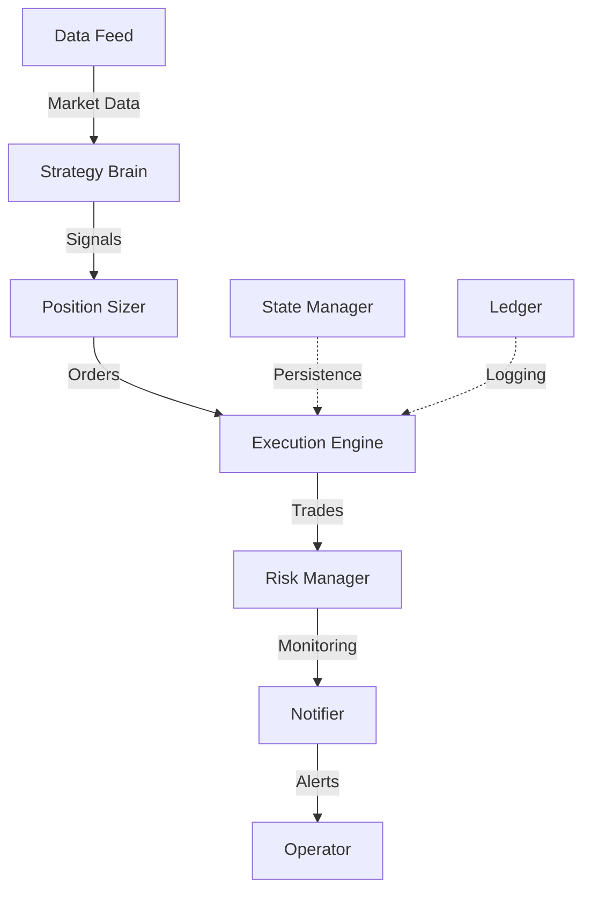

<div align="center">

# 🔥 Project Chimera

### A Professional-Grade Cryptocurrency Funding Rate Arbitrage Bot

[](https://www.python.org/)
[](https://github.com/ccxt/ccxt)
[](LICENSE)
[]()

_An institutional-quality quantitative trading system that systematically exploits funding rate arbitrage opportunities_

[Features](#-key-features) • [Strategy](#-the-strategy) • [Architecture](#-system-architecture) • [Installation](#-installation) • [Usage](#-usage-guide) • [Research](#-research-framework)

</div>

---

## 📋 Table of Contents

- [Overview](#-overview)
- [Core Philosophy](#-core-philosophy)
- [The Strategy](#-the-strategy)
- [Key Features](#-key-features)
- [System Architecture](#-system-architecture)
- [Tech Stack](#-tech-stack)
- [Project Structure](#-project-structure)
- [Installation](#-installation)
- [Configuration](#-configuration)
- [Usage Guide](#-usage-guide)
- [Research Framework](#-research-framework)
- [Contributing](#-contributing)

---

## 🎯 Overview

**Project Chimera** is a sophisticated, fully autonomous trading bot designed to systematically exploit funding rate arbitrage opportunities in the cryptocurrency markets. This project has evolved from a simple hobby bot into a production-grade, institutional-quality quantitative trading system, built with a **"safety-first"** and **data-driven philosophy**.

> 💡 **Key Insight**: The system is architected to be a long-term, self-sufficient trading business, starting with a small capital base (€100) and intelligently scaling its operations as it grows.

---

## 🧠 Core Philosophy

<div align="center">

### _"Don't predict the market. Exploit its inefficiencies."_

</div>

Guided by the principles of professional quantitative finance, this bot does not attempt to predict market direction. Instead, it exploits a structural market inefficiency known as **Funding Rate Arbitrage**.

---

## 🎯 The Strategy

### "The Sniper" - Delta-Neutral Arbitrage

Our core strategy is a **delta-neutral**, "long spot, short perpetuals" arbitrage system designed to be a patient "sniper," waiting for periods of extreme and stable positive funding rates.

<table>
<tr>
<td width="50%">

#### 📊 The Edge

During bullish periods, perpetual futures often trade at a premium to spot price. Longs pay shorts a "funding rate" every 8 hours - we capture this as near risk-free profit.

</td>
<td width="50%">

#### 🎯 Regime Filter

Only enters trades when both current APR and rolling average APR exceed optimized thresholds (e.g., >12%), ensuring stable, high-conviction regimes.

</td>
</tr>
<tr>
<td width="50%">

#### ⏳ Patience

Designed to be in cash most of the time, preserving capital until high-probability opportunities arise. Executes a small number of highly profitable trades per year.

</td>
<td width="50%">

#### 🌐 Diversification

Trades a portfolio of assets (BTC, ETH, SOL, DOGE), each with unique optimized parameters to increase trade frequency and smooth returns.

</td>
</tr>
</table>

---

## ✨ Key Features

<div align="center">

| Feature                               | Description                                                          |
| ------------------------------------- | -------------------------------------------------------------------- |
| **🪙 Multi-Asset Portfolio**          | Trades a basket of pre-optimized assets with unique parameters       |
| **📈 Progressive Capital Management** | Intelligently scales strategy, unlocking new assets as account grows |
| **🛡️ Production-Hardened Engine**     | Professional-grade safety features for 24/7 reliability              |
| **💾 State Recovery**                 | Survives crashes/restarts without losing position tracking           |
| **🔐 Data Integrity**                 | Validates exchange time and market data integrity                    |
| **📱 Real-Time Monitoring**           | Comprehensive alerts via Telegram bot integration                    |
| **🔧 Modular Architecture**           | Clean separation of concerns for maintainability                     |
| **🔬 Research Framework**             | Powerful backtester and parameter optimizer included                 |

</div>

---

## 🏗️ System Architecture

The bot follows a **"Brain, Muscles, Hands"** analogy with modular components:



### Component Breakdown

| Component                 | File                             | Responsibility                                      |
| ------------------------- | -------------------------------- | --------------------------------------------------- |
| **🧠 The Brain**          | `strategy.py`                    | Holds optimized parameters, scans for opportunities |
| **💪 The Muscles**        | `position_sizer.py`              | Calculates precise, safely-sized trade orders       |
| **🤲 The Hands**          | `execution.py`                   | State machine managing entire trade lifecycle       |
| **👁️ The Senses**         | `data_feed.py`                   | Resilient exchange connection with time sync        |
| **🛡️ The Safety Net**     | `risk_manager.py`                | Monitors drawdowns, maintenance, memory usage       |
| **📡 The Nervous System** | `notifier.py`                    | Real-time alerts for critical actions               |
| **🧬 The Memory**         | `state_manager.py` & `ledger.py` | Position persistence and trade recording            |

---

## 🛠️ Tech Stack

<div align="center">

|                                                     Technology                                                      |       Role        | Why We Chose It                                   |
| :-----------------------------------------------------------------------------------------------------------------: | :---------------: | :------------------------------------------------ |
|            |   Core Language   | Universal standard for quant research and trading |
|                                   |   Exchange API    | Premier unified API for crypto exchanges          |
|  | Data Manipulation | Ultimate tool for time-series analysis            |
|             |   Configuration   | Professional standard for managing secrets        |
|                                   | System Monitoring | Cross-platform process monitoring                 |
|                                     |   HTTP Requests   | Robust library for API calls                      |

</div>

---

## 📁 Project Structure

```
crypto-trading-bot/
│
├── 📄 .env                     # API keys and secrets (local only)
├── 📋 requirements.txt         # Project dependencies
├── 📖 README.md               # This file
│
├── 📊 data/                   # Raw data and trade logs
│   └── paper_trade_log.csv
│
├── 📝 logs/                   # Daily application log files
│
├── 🔬 research_results/       # Curated outputs from research phase
│
└── 💻 src/                    # Main source code package
    ├── __init__.py
    │
    ├── 🚀 live_trader.py      # <<<< MAIN APPLICATION ENTRY POINT
    │
    ├── 🧠 strategy.py         # The "Brain"
    ├── 💪 position_sizer.py   # The "Muscles"
    ├── 🤲 execution.py        # The "Hands"
    ├── 🛡️ risk_manager.py     # The "Safety Net"
    ├── 👁️ data_feed.py        # The "Senses"
    ├── 📒 ledger.py          # Paper Trading Memory
    ├── 📥 collect_data.py    # Data downloading utility
    │
    ├── 🤖 bot/               # Sub-package for utilities
    │   ├── __init__.py
    │   ├── 📡 notifier.py
    │   ├── 📝 logger.py
    │   └── 💾 state_manager.py
    │
    └── 🔬 research/          # Research toolkit
        ├── __init__.py
        ├── 🔍 funding_rate_scanner.py
        ├── ⚙️ optimizer.py
        └── 📈 funding_arb_backtester.py
```

---

## 🚀 Installation

### Prerequisites

- Python 3.10 or higher
- Git
- Binance Testnet account
- Telegram Bot (for notifications)

### Step-by-Step Setup

<details>
<summary><b>1️⃣ Clone the Repository</b></summary>

```bash
git clone <repository_url>
cd crypto-trading-bot
```

</details>

<details>
<summary><b>2️⃣ Create Virtual Environment</b></summary>

```bash
python -m venv venv
```

</details>

<details>
<summary><b>3️⃣ Activate Environment</b></summary>

**Windows:**

```powershell
.\venv\Scripts\Activate.ps1
```

**macOS/Linux:**

```bash
source venv/bin/activate
```

</details>

<details>
<summary><b>4️⃣ Install Dependencies</b></summary>

```bash
pip install -r requirements.txt
```

</details>

---

## ⚙️ Configuration

### Environment Setup

1. **Create Configuration File**

   ```bash
   cp .env.example .env
   ```

2. **Configure API Credentials**

   <details>
   <summary><b>🔐 Binance Testnet Setup</b></summary>

   - Visit [Binance Testnet](https://testnet.binance.vision/)
   - Log in with GitHub
   - Generate API key and secret
   - ⚠️ **CRITICAL**: Use ONLY testnet keys, never real Binance keys!
   </details>

   <details>
   <summary><b>📱 Telegram Bot Setup</b></summary>

   - Message [@BotFather](https://t.me/BotFather) on Telegram
   - Create new bot and copy token
   - Get your chat ID from [@userinfobot](https://t.me/userinfobot)
   </details>

3. **Edit `.env` File**

   ```ini
   # --- BINANCE TESTNET ---
   BINANCE_TESTNET_API_KEY="<YOUR_TESTNET_API_KEY>"
   BINANCE_TESTNET_API_SECRET="<YOUR_TESTNET_SECRET_KEY>"

   # --- TELEGRAM ---
   TELEGRAM_TOKEN="<YOUR_BOT_TOKEN>"
   TELEGRAM_CHAT_ID="<YOUR_PERSONAL_CHAT_ID>"
   ```

---

## 📚 Usage Guide

> 💡 **Note**: All commands should be run from the root directory with virtual environment activated.

### 1️⃣ Data Collection

<table>
<tr>
<td>

**Download OHLCV Price Data**

```bash
python -m src.collect_data ohlcv ETH/USDT
```

</td>
<td>

**Download Funding Rates**

```bash
python -m src.collect_data funding ETH/USDT
```

</td>
</tr>
</table>

### 2️⃣ Research & Optimization

<table>
<tr>
<td>

**Scan Live Funding Rates**

```bash
python -m src.research.funding_rate_scanner
```

</td>
<td>

**Optimize Parameters**

```bash
# Edit SYMBOL_TO_OPTIMIZE in optimizer.py first
python -m src.research.optimizer
```

</td>
</tr>
</table>

### 3️⃣ Live Paper Trading

**Start the Bot** 🚀

```bash
python -m src.live_trader
```

The bot will:

- ✅ Initialize all components
- 📱 Send Telegram confirmation
- 🔄 Begin 24/7 operation loop
- 📝 Log to console and daily files
- 💾 Save trades to `data/paper_trade_log.csv`

---

## 🔬 Research Framework

The research package includes powerful tools for strategy development:

| Tool           | Purpose                                | Usage                                  |
| -------------- | -------------------------------------- | -------------------------------------- |
| **Scanner**    | Find current arbitrage opportunities   | Real-time market scanning              |
| **Optimizer**  | Discover optimal parameters            | Grid search with walk-forward analysis |
| **Backtester** | Validate strategies on historical data | Full transaction cost modeling         |

---

## 🤝 Contributing

We welcome contributions! Please see our [Contributing Guidelines](CONTRIBUTING.md) for details.

---

<div align="center">

### 📝 License

This project is licensed under the MIT License - see the [LICENSE](LICENSE) file for details.

---

**Built with ❤️ by quantitative traders, for quantitative traders**

_Remember: Past performance does not guarantee future results. Trade responsibly._

</div>
